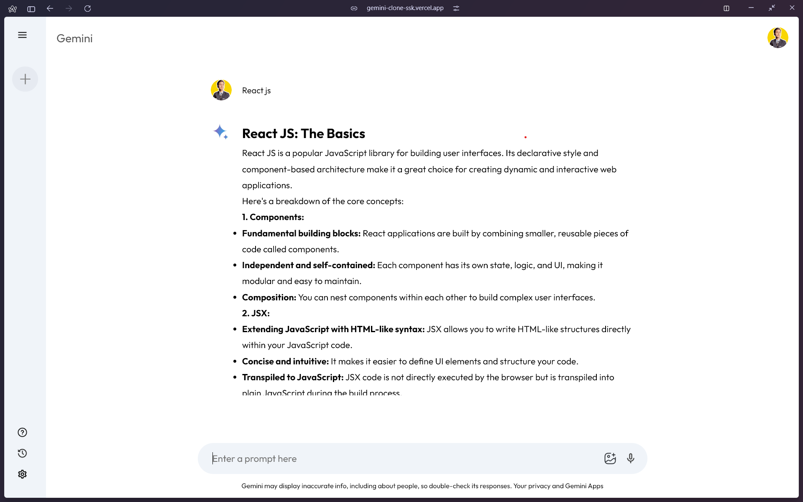

# GEMINI-CLONE

## 

#### HOST: [gemini-clone-ssk](https://gemini-clone-ssk.vercel.app)

---

### Table of Contents

- Features
- Technologies Used

---

### Features

- **Responsive Design**: Adapts to different screen sizes.
- **Interactive UI**: Dynamic elements and animations enhance user interaction.
- **State Management**: Efficently manage the application state using Context API.
- **API Integration**: Seamlessly intergrates with external APIs to fetch and display data.
- **Accessiblity**: Follows best practices to ensure the app is accessible to all users.

---

### Technologies Used

- **React**: JavaScript library for building user interfaces.
- **CSS Modules**: Scoped CSS for styling components.
- **Context API**: For managing global state across the app.
- **Webpack**: Module bundler to compile JavaScript and other assets.
- **Babel**: JavaScript compiler to use the latest JavaScript features.
